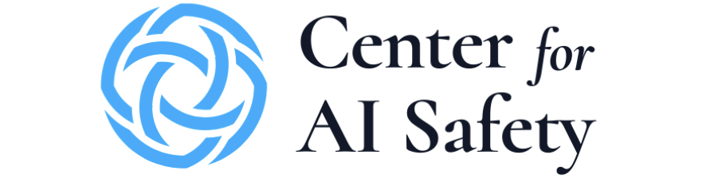
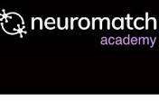
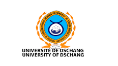
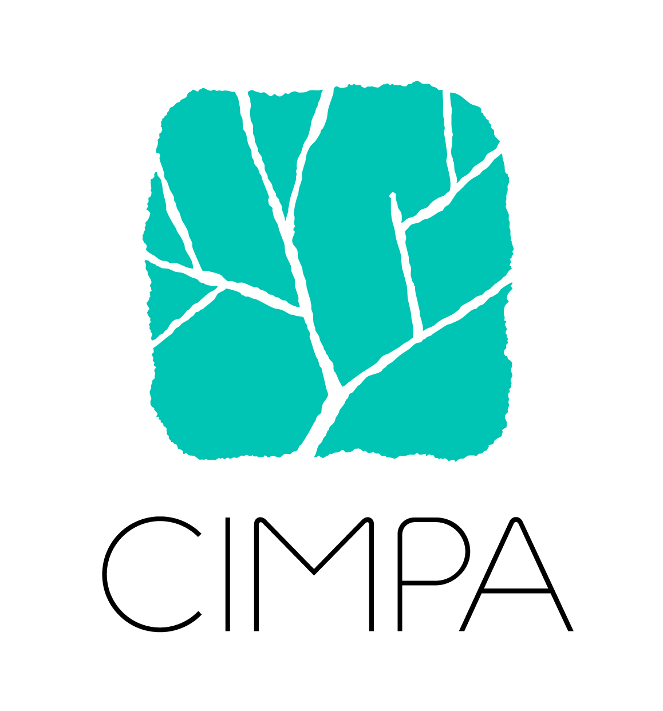
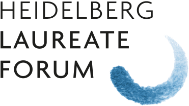
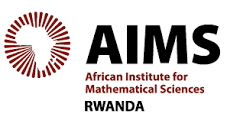
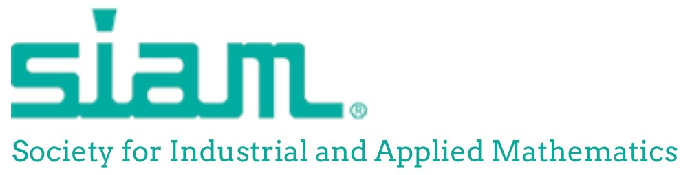



  

    This page provides a structured overview of my academic training, technical skills,
    professional experience, and selected scientific activities.
  

  

  <a class="cv-button" href="cv-full.html">
    View full static CV
  </a>

---

# Education

  

    

      
    

    

      

        <h3><a href="https://www.ucalgary.ca/">University of Calgary</a>, Canada</h3>
        Sep. 2022 – Dec. 2026
      

      
<strong>Ph.D. in Biostatistics</strong>

      
Supervisor: <a href="https://sites.google.com/site/quanlongresearch/">Dr. Quan Long</a>

    

  

  

    

      
    

    

      

        <h3><a href="https://www.ug.edu.gh/">University of Ghana / AMMI Ghana</a></h3>
        Oct. 2019 – Jun. 2021
      

      
<strong>M.Sc. in Machine Intelligence</strong>

      
Supervisor: <a href="https://www.healthdata.org/about/people/moustapha-cisse">Prof. Moustapha Cissé</a>

      
Thesis: <em>Optimization and Generalization of Shallow Neural Networks with Quadratic Activation Functions</em>

      
Full scholarship funded by Facebook and Google through <a href="https://aimsammi.org/">AMMI</a>.

    

  

  

    

      
    

    

      

        <h3><a href="https://aims-senegal.org/">African Institute for Mathematical Sciences, Senegal</a></h3>
        Aug. 2018 – Jun. 2019
      

      
<strong>M.Sc. in Mathematical Sciences</strong>

      
Supervisor: Dr. André Saint Eudes Mialebama Bouesso

      
Thesis: <em>Abelian Extensions and Crossed Modules for Lie Algebras</em>

      
Full scholarship funded by the MasterCard Foundation through AIMS Senegal.

    

  

  

    

      
    

    

      

        <h3><a href="https://www.univ-dschang.org/">University of Dschang</a>, Cameroon</h3>
        2016 – 2018
      

      
<strong>Master’s Degree in Mathematics</strong>

      
Supervisor: Dr. Calvin Tcheka

      
Thesis: <em>(Co)homologie des espaces de configuration</em>

    

  

  

    

      
    

    

      

        <h3><a href="https://www.univ-dschang.org/">University of Dschang</a>, Cameroon</h3>
        2012 – 2016
      

      
<strong>B.Sc. in Mathematics and Computer Science</strong>

    

  

---

# Skills

  

    <h4>Programming</h4>
    
Python, R, Java, MATLAB/Octave

  

  

    <h4>Machine Learning Libraries</h4>
    
PyTorch, TensorFlow, scikit-learn

  

  

    <h4>Tools</h4>
    
Git, LaTeX, Jupyter, Linux/HPC

  

  

    <h4>Languages</h4>
    
English, French

  

---

# Professional Experience

  

    

      
    

    

      

        <h3><a href="https://www.ucalgary.ca/">University of Calgary</a></h3>
        2022 – Present
      

      
<strong>Graduate Teaching Assistant</strong>

      

        Faculty of Medicine and Department of Mathematics and Statistics.
      

      <ul>
        <li>Supported teaching, tutorials, grading, office hours, and instructional preparation.</li>
        <li>Assisted students in biostatistics, mathematics, and data-analysis-related coursework.</li>
        <li>Contributed to laboratory supervision and academic support activities.</li>
      </ul>
    

  

  

    

      
    

    

      

        <h3><a href="https://www.virtuclinic.ca/">VirtuClinic Inc.</a>, Alberta, Canada</h3>
        2024 – Present
      

      
<strong>Artificial Intelligence Technical Lead / CTO</strong>

      

        Led the design and deployment of AI-powered automation systems and Digital Health Advisors
        to support healthcare, wellness, patient engagement, and business operations.
      

      <ul>
        <li>Designed and improved AI Digital Health Advisors for client-facing healthcare and wellness services.</li>
        <li>Developed AI agents for customer discovery, workflow automation, web scraping, lead scoring, and business analytics.</li>
        <li>Supported technical strategy in machine learning, natural language processing, and agentic AI systems.</li>
        <li>Contributed to data governance practices aligned with privacy and health-information protection requirements.</li>
      </ul>
    

  

  

    

      
    

    

      

        <h3>
          <a href="https://scale.com/blog/new-era-outlier">Scale AI / Outlier / Center for AI Safety</a> and
          <a href="https://datalab.portexai.com/">PortexAI</a>
        </h3>
        2024 – Present
      

      
<strong>Prompt Engineer / AI Quality Control Contributor</strong>

      

        Contributed to the evaluation and improvement of large language models, with a focus on
        reasoning, summarization, and general knowledge.
      

      <ul>
        <li>Developed and reviewed advanced prompts for benchmarking frontier AI systems.</li>
        <li>Contributed to high-difficulty scientific and academic evaluation tasks.</li>
        <li>Participated in work related to large-scale AI benchmark development, including Humanity’s Last Exam.</li>
      </ul>
    

  

  

    

      
    

    

      

        <h3><a href="https://academy.neuromatch.io/">Neuromatch Academy</a></h3>
        2022 – Present
      

      
<strong>Production Team Member and Teaching Assistant in Deep Learning / Neuroscience</strong>

      

        Supported students in computational neuroscience and deep learning through tutorials,
        project guidance, and technical mentoring.
      

    

  

  

    

      
    

    

      

        <h3><a href="http://www.manobi.com/">ICRISAT / MANOBI Africa</a></h3>
        2021 – 2022
      

      
<strong>Data Scientist</strong>

    

  

  

    

      
    

    

      

        <h3><a href="https://www.univ-dschang.org/">University of Dschang</a>, Cameroon</h3>
        2016 – 2018
      

      
<strong>Teaching Assistant in Mathematics</strong>

    

  

---

# Selected Academic and Scientific Activities

  

    

      
    

    

      

        <h3><a href="https://www.cimpa.info/">CIMPA Research School</a></h3>
        2018
      

      
<strong>Centre International de Mathématiques Pures et Appliquées</strong>, Yaoundé, Cameroon.

      
Topic: <em>Application of Algebraic Topology in Robotics</em>.

    

  

  

    

      
    

    

      

        <h3><a href="https://www.heidelberg-laureate-forum.org/">Heidelberg Laureate Forum</a></h3>
        2019 and 2021
      

      

        Selected participant at the 7th and 8th Heidelberg Laureate Forum, Germany.
      

    

  

  

    

      
    

    

      

        <h3><a href="https://fosc.nexteinstein.org/participants/">Future of Science Conference</a></h3>
        2019
      

      
Kigali, Rwanda.

    

  

  

    

      
    

    

      

        <h3><a href="https://sites.google.com/aims.ac.za/g2s3-aims-2021/people?authuser=0">11th Gene Golub SIAM Summer School</a></h3>
        2021
      

      
Theory and Practice of Deep Learning, Cape Town, South Africa.

    

  

