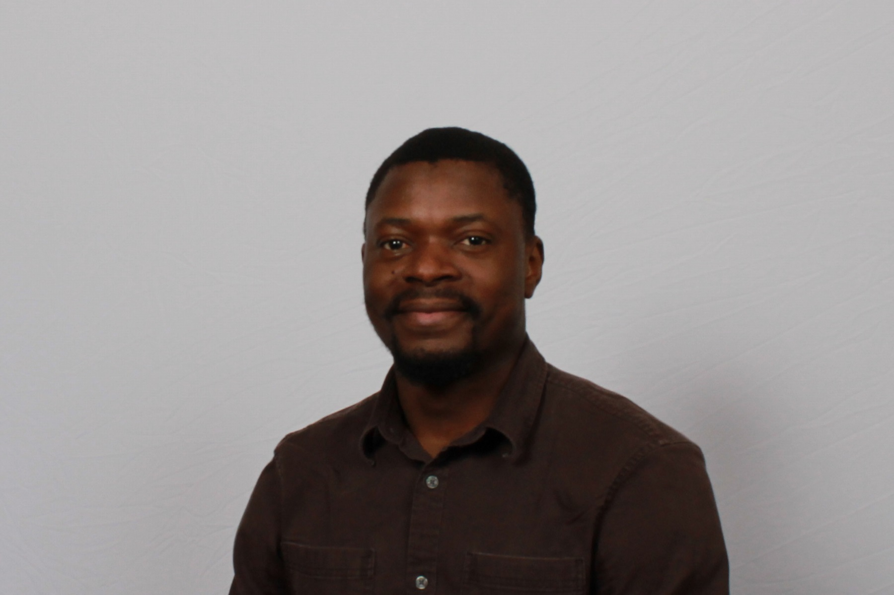



  

    
  

<!-- ===================== HERO SECTION ===================== -->

<section class="home-hero">

  

    
PhD Researcher · Biostatistics · AI for Genomics

    <h1>Ariel Ghislain Kemogne Kamdoum</h1>

    <h2>
      Developing interpretable AI and biostatistical methods for genomic discovery,
      complex disease analysis, and digital health innovation.
    </h2>

    

      I am a PhD researcher at the
      <a href="https://www.ucalgary.ca/" target="_blank">University of Calgary</a>,
      working at the intersection of statistical genetics, deep learning,
      explainable AI, and biostatistics. My research focuses on representation learning
      for high-dimensional genomic data, with applications to polygenic risk,
      heritability, disease biology, and precision medicine.
    

    

      <a href="/cv/" class="primary-button">View CV</a>
      <a href="/publications/" class="secondary-button">Publications</a>
      <a href="/projects/" class="secondary-button">Selected Projects</a>
      <a href="https://scholar.google.com/citations?user=q7dQio4AAAAJ" target="_blank" class="secondary-button">Google Scholar</a>
    

  

  

    
  

</section>

<!-- ===================== QUICK PROFILE ===================== -->

<section class="home-grid">

  

    <h3>Current Position</h3>
    

      PhD Researcher in Biostatistics at the University of Calgary,
      affiliated with Quan Long’s Lab.
    

  

  

    <h3>Research Area</h3>
    

      Statistical genetics, representation learning, explainable AI,
      polygenic analysis, and genomic medicine.
    

  

  

    <h3>Technical Focus</h3>
    

      Deep learning, variational autoencoders, interpretable ML,
      survival analysis, and high-dimensional data modeling.
    

  

</section>

---

# About Me

I am **Ariel Ghislain Kemogne Kamdoum**, a PhD researcher at the
[University of Calgary, Canada](https://www.ucalgary.ca/), where I develop
novel biostatistical and representation-learning methods to identify genetic
factors underlying complex diseases, including cancer, cardiovascular disorders,
and other complex traits.

My work bridges **statistical genetics**, **deep learning**, **explainable AI**,
and **biostatistics**, with a strong emphasis on interpretability, biological
mechanism, and clinically meaningful genomic discovery.

My academic foundation is in **Mathematics**, **Computer Science**, and
**Machine Intelligence**. I completed graduate training at the University of
Dschang, the African Institute for Mathematical Sciences in Senegal, and the
African Master’s in Machine Intelligence program in Ghana.

More information is available on my
[ORCID profile](https://orcid.org/0009-0007-1926-7695).

---

# Research Interests

  Artificial Intelligence
  Machine Learning
  Deep Learning
  Representation Learning
  Statistical Genetics
  Biostatistics
  Bioinformatics
  Explainable AI
  Polygenic Risk
  Precision Medicine

---

# Featured Highlights

  

    <h3>gVAE Research</h3>
    

      Developing stable and interpretable representation-learning models for
      high-dimensional genomic cohorts with moderate sample sizes.
    

  

  

    <h3>AI Benchmark Contributions</h3>
    

      Contributor to expert-level AI evaluation benchmarks, including
      Humanity’s Last Exam and COMPOSITE-Stem.
    

  

  

    <h3>Digital Health Innovation</h3>
    

      Supporting the design of AI-powered Digital Health Advisors for
      responsible and privacy-aware virtual care applications.
    

  

---

# Recent News

  

    May 2026
    

      Selected to present an oral talk at the
      <strong>2026 Statistical Society of Canada Annual Meeting</strong>
      at McMaster University, Hamilton, Ontario, for the
      <strong>Student Research Presentation Awards</strong>.
    

  

  

    Feb. 2026
    

      Serving as a Teaching Assistant for the UCBC Statistical Data Privacy Workshop,
      University of Calgary Biostatistics Centre.
    

  

  

    Jul. 2025
    

      Delivered an oral talk at the BIRS Workshop,
      <em>Novel Statistical Approaches for Studying Multi-omics Data</em>,
      Banff International Research Station, Banff, Alberta.
    

  

  

    Dec. 2024
    

      Participated in NeurIPS 2024 at the Vancouver Convention Centre, Canada.
    

  

  More updates are available in the full news section below.

---

# Awards and Recognition

  

    <strong>Student Research Presentation Awards Nominee</strong>,
    Statistical Society of Canada Annual Meeting, 2026.
  

  

    <strong>Alberta Innovates Graduate Scholarship</strong>,
    2023–2026.
  

  

    <strong>Indigenous and Black Momentum Scholarship in Science</strong>,
    2022–2023.
  

  

    <strong>Graduate Teaching Assistant Excellence Award</strong>,
    Department of Mathematics and Statistics, University of Calgary, 2024.
  

---

# Alberta Innovates and Digital Health

As an Alberta Innovates Scholar, I contribute to Alberta’s digital health ecosystem
through the design and development of AI-powered Digital Health Advisors at
VirtuClinic Inc. My work focuses on translating artificial intelligence, machine
learning, and natural language processing research into practical digital health
systems that support virtual care, mental-health support, patient engagement,
and healthcare operations.

The work emphasizes responsible AI, privacy-aware design, health-data governance,
and compliance with Canadian health-information protection standards.

  <a href="https://www.virtuadvisor.ca" target="_blank" class="primary-button">Try the Digital Health Advisors</a>
  <a href="https://docs.google.com/forms/d/e/1FAIpQLSe6zfiql3ZGmUO5Q1SUIj2X8DJLGxUaO14XAqJOnNNi4cB7qA/viewform?usp=sharing&ouid=105488904174897357821" target="_blank" class="secondary-button">Share Feedback</a>

---

# Memberships

  

    <h3>ASHG</h3>
    
American Society of Human Genetics

  

  

    <h3>SSC</h3>
    
Statistical Society of Canada

  

  

    <h3>Digital Health Canada</h3>
    
Digital health, virtual care, and health-data governance.

  

  

    <h3>Neuromatch Academy</h3>
    
Machine learning, computational neuroscience, and open science.

  

  

    <h3>Technology Alberta</h3>
    
Innovation, technology commercialization, and industry collaboration.

  

---

# Teaching

<strong>Graduate Teaching Assistant, University of Calgary — Winter 2026</strong>

<ul>
  <li>
    <em>STAT 205: Introduction to Statistical Inquiry</em> —
    applied statistical thinking, data collection, exploratory analysis,
    probability, inference, confidence intervals, and hypothesis testing.
  </li>

  <li>
    <em>STAT 323: Introduction to Theoretical Statistics</em> —
    probability theory, random variables, distributions, expectations,
    sampling distributions, and foundations of statistical inference.
  </li>
</ul>

---

# Selected Talks and Presentations

  

    <strong>BIRS Workshop</strong>, Banff International Research Station, Canada, 2025.
     
    <em>Quantile-Gated Variational Autoencoder: Application to High-Dimensional Data with Small Sample Size.</em>
  

  

    <strong>Deep Learning Reading Club</strong>, University of Calgary, 2023–2024.
  

  

    <strong>Gene Golub SIAM Summer School</strong>, Cape Town, South Africa, 2021.
     
    <a href="https://proceedings.neurips.cc/paper/2013/file/ac1dd209cbcc5e5d1c6e28598e8cbbe8-Paper.pdf" target="_blank">
      Accelerating Stochastic Gradient Descent using Predictive Variance Reduction
    </a>.
  

  

    <strong>African Institute for Mathematical Sciences</strong>, Dakar, Senegal, 2019.
     
    <a href="https://arxiv.org/abs/1802.04061" target="_blank">
      Abelian extension and crossed module for Lie algebras
    </a>.
  

  

    <strong>University of Calgary</strong>, Canada, 2023.
     
    Talks on hidden Markov models, support vector machines, kernels for computational biology,
    genomic deep learning, and representation learning.
  

---

# Full News Archive

<ul>
  <li><strong>May 2026:</strong> Oral talk at the 2026 Statistical Society of Canada Annual Meeting, McMaster University, Hamilton, Ontario.</li>
  <li><strong>February 2026:</strong> Teaching Assistant for the UCBC Statistical Data Privacy Workshop, University of Calgary Biostatistics Centre.</li>
  <li><strong>July 2025:</strong> Oral talk at the BIRS Workshop on Novel Statistical Approaches for Studying Multi-omics Data.</li>
  <li><strong>December 2024:</strong> Participant at NeurIPS 2024, Vancouver Convention Centre, Canada.</li>
  <li><strong>September 2023:</strong> Reviewer for short papers at Deep Learning Indaba 2023, Ghana.</li>
  <li><strong>August 2023:</strong> Organizer of the Data Science Workshop for Alberta High School Students.</li>
  <li><strong>July 2023:</strong> Teaching Assistant for the Neuromatch Academy Deep Learning course.</li>
  <li><strong>June 2023:</strong> Talk at the BMB Advance Conference, Calgary, Canada.</li>
  <li><strong>May–June 2023:</strong> Participant at BioNet Conference 2023, University of Alberta, Edmonton.</li>
  <li><strong>October 2022:</strong> Participant at the 42nd Annual Meeting of Alberta Statisticians, University of Alberta.</li>
  <li><strong>July 2022:</strong> Teaching Assistant at Neuromatch Academy summer school.</li>
  <li><strong>June 2022:</strong> Participant at the Hausdorff School on foundational methods in machine learning, Bonn, Germany.</li>
  <li><strong>January 2022:</strong> Joined the University of Calgary as a PhD student in Biostatistics.</li>
  <li><strong>July 2021:</strong> Participant at the 11th Gene Golub SIAM Summer School, Cape Town, South Africa.</li>
  <li><strong>September 2021:</strong> Participant at the 8th Heidelberg Laureate Forum.</li>
  <li><strong>December 2020:</strong> Completed M.Sc. in Machine Intelligence through AMMI Ghana.</li>
  <li><strong>September 2019:</strong> Participant at the 7th Heidelberg Laureate Forum, Heidelberg, Germany.</li>
  <li><strong>July 2019:</strong> Participant at the Future of Science Conference, Kigali, Rwanda.</li>
  <li><strong>June 2019:</strong> Completed M.Sc. in Mathematical Sciences at AIMS Senegal.</li>
  <li><strong>July 2018:</strong> Completed Master’s degree in Mathematics at the University of Dschang, Cameroon.</li>
  <li><strong>April 2018:</strong> Participant at CIMPA, Yaoundé, Cameroon.</li>
</ul>

---

# Contact

  <strong>Email:</strong>
  <a href="mailto:arielghislain.kemogn@ucalgary.ca">arielghislain.kemogn@ucalgary.ca</a>

  <strong>Phone:</strong> +1 587-581-0281

  <strong>Languages:</strong> French and English

