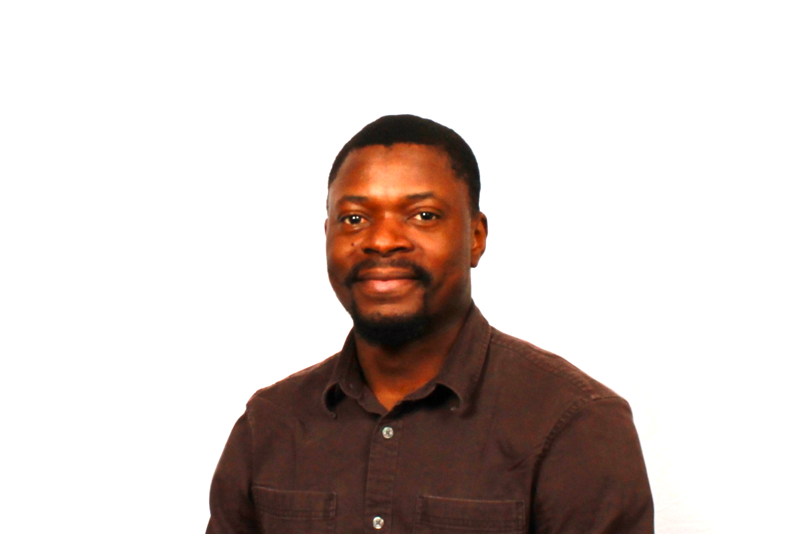



  

    
  

  <h1>
    Homepage
     <small>{{ site.tagline }}</small>
  </h1>

### About Me

I'm Ariel Ghislain Kemogne Kamdoum, a PhD researcher at the [University of Calgary, Canada](https://www.ucalgary.ca/), where I develop novel biostatistical and representation learning (AI/ML) methods to identify genetic factors underlying complex diseases such as cancer and cardiovascular disorders, with a strong emphasis on interpretability and mechanistic insight. My research bridges statistical genetics, deep learning, and explainable AI to improve our understanding of disease biology and heritability.

My academic foundation is in Mathematics and Computer Science, with a focus on Machine Intelligence. I completed my Master's degree in Mathematics from the [University of Dschang, Cameroon](https://www.univ-dschang.org/), Cameroon, where I explored algebraic topology and its applications in robotics. Motivated by the profound implications of Mathematical Sciences, I expanded my education at the African Institute for Mathematical Sciences (AIMS), earning two MSc degrees from [Senegal](https://aims-senegal.org/) and [Ghana](https://aims.edu.gh/) in Mathematical Sciences and [Machine Intelligence](https://aimsammi.org/), respectively.

My professional experience includes data science roles at [ICRISAT/MANOBI](https://www.manobi.com/) and teaching assistant positions at [Neuromatch Academy (NMA)](https://academy.neuromatch.io/), focusing on deep learning and neuroscience. Currently, as a part of [Quan Long's Lab](https://sites.google.com/site/quanlongresearch/group-members?authuser=0) at the [University of Calgary](https://www.ucalgary.ca/), I am enthusiastically applying my combined expertise in statistics and machine intelligence to address real-world challenges.

More on [ORCID](https://orcid.org/0009-0007-1926-7695).

Language: French (Native) & English (Fluent).

---

### Teaching (Winter 2026)

Graduate Teaching Assistant at University of Calgary, Alberta, Canada:

1- STAT 205: Introduction to Statistical Inquiry

An applied introduction to statistical thinking, focusing on data collection, exploratory data analysis, probability concepts, statistical inference, confidence intervals, hypothesis testing, and real-world data interpretation.

2- STAT 323: Introduction to Theoretical Statistics

A mathematically grounded course covering probability theory, random variables, common distributions, expectations, sampling distributions, and the theoretical foundations underlying statistical inference.

---

### Awards 

1- 2023 Alberta Innovates Graduates Scholarship, 2023-2026

2- Indigenous and Black Momentum Scholarship in Science, 2022-2023

3- Graduate Teaching Assistant (GAT) Excellence Award Department of Mathematics and Statistics, University of Calgary, 2024

Innovations:  
As an Alberta Innovates Scholar, I contribute to Alberta’s digital health ecosystem through the design and development of AI-powered Digital Health Advisors (DHAs) at VirtuClinic Inc., in collaboration with innovation networks connected to Alberta Innovates and Technology Alberta. My work focuses on translating advanced artificial intelligence, machine learning, and natural language processing research into scalable, real-world digital health systems that enhance virtual care delivery, mental-health support, patient engagement, and healthcare operations across Alberta. I lead the technical architecture and governance of DHAs with a strong emphasis on privacy-preserving design, ensuring full compliance with Canadian health data regulations, including HIA, PIPEDA, POPA, and FOIP, and guaranteeing that no Personal Health Information is stored, processed, or transmitted by these systems. Through this work, I support Alberta’s strategic priorities in responsible AI, health system innovation, and technology commercialization by building trustworthy, regulation-compliant AI solutions that improve access to care, operational efficiency, and digital health readiness across the province.

Digital Health Advisors (DHAs) Access: www.virtuadvisor.ca

---

### Memberships

1- American Society of Human Genetics (ASHG):
Member of the leading international professional society advancing research, education, and clinical practice in human genetics. ASHG fosters cutting-edge discoveries in genomics, statistical genetics, and precision medicine through high-impact conferences, publications, and collaborative initiatives.

2- Statistical Society of Canada (SSC):
Member of Canada’s national organization promoting excellence in statistics, probability, and data science. SSC supports methodological innovation, interdisciplinary research, and the application of statistical science to public policy, health, and society.

3- Digital Health Canada:
Member of Canada’s principal professional association for digital health leaders. This network connects innovators, clinicians, researchers, and policymakers working to advance AI-driven healthcare, virtual care, interoperability, and responsible health data governance.

4- Neuromatch Academy:
Member of a global, community-driven academy focused on advanced training and collaboration in machine learning, computational neuroscience, and AI. Neuromatch Academy emphasizes open science, rigorous methodology, and cross-disciplinary research.

5- Technology Alberta:
Member of Alberta’s innovation ecosystem supporting technology commercialization, entrepreneurship, and industry–academic collaboration across AI, health tech, and emerging digital sectors.

---

### Research Interests
My research interests include but not limited to:

- Artificial Intelligence (AI)

- Machine learning/Deep Learning (Representation learning, Deep learning, Optimization)

- Statistical genetics
  
- Biostatistics/Bioinformatics

---

### Talks and Presentations
- Title- "Quantile-Gated Variational Autoencoder: Application to High Dimentional Data with Small Sample Size"; BIRS Workshop- "Novel Statistical Approaches for Studying Multi-omics Data", July 13 - 18, 2025, Banff International Research Station, Banff, AB, Canada
- Speaker at the Deep learning reading club, University of Calgary, Canada, 2023-2024
- [Accelerating Stochastic Gradient Descent using Predictive Variance Reduction](https://proceedings.neurips.cc/paper/2013/file/ac1dd209cbcc5e5d1c6e28598e8cbbe8-Paper.pdf), Gene Golub SIAM Summer School, Cape Town, South Africa, 2021
&nbsp;&nbsp;&nbsp;&nbsp;&nbsp;[Reference](https://sites.google.com/aims.ac.za/g2s3-aims-2021/groups?authuser=0).
- [Abelian extension and crossed module for Lie algebras](https://arxiv.org/abs/1802.04061), African Institute for Mathematical Sciences(AIMS), Dakar, Senegal, 2019 
- (Co)homologie des espaces de configuration, [University of Dschang, Cameroon](https://www.univ-dschang.org/), 2018
- Introduction to Hidden Markov Chain Models, [University of Calgary](https://www.ucalgary.ca/), Canada, 2023 
- Support Vector Machines and Kernels for Computational Biology, [University of Calgary](https://www.ucalgary.ca/), Canada, 2023 
- Deep learning of genomic variation and regulatory network data, [University of Calgary](https://www.ucalgary.ca/), Canada, 2023 
- Understanding of representation learning in machine learning,[University of Calgary](https://www.ucalgary.ca/), Canada, 2023

---

### News
- [July 2025] Oral Talk, BIRS Workshop, "Novel Statistical Approaches for Studying Multi-omics Data", July 13 - 18, 2025, Banff International Research Station, Banff, AB, Canada

- [December 2024] NeurIPS 2024, Participant at NeurIPS (Neural Information Processing Systems) conference, Vancouver Convention Center, Canada (2024)
  
- [September 2023] Happy to be part of the reviewers of short papers of Deep Learning Indaba conference 2023, Ghana
  
- [August 2023] Happy to be part of the organizers of the Data Science Workshop for Alberta High School Students: Two-day’s workshop that will be hosted in the Math/Stats department at the University of Calgary, Canada. Students in Calgary will attend in-person, and other students in Alberta.
  
- [July 2023] Exciting three weeks from July 10, 2023 to July 28, 2023 with [Neuromatch Academy (NMA)](https://academy.neuromatch.io/) as a regular Teaching Assistant in Deep Learning course
   
- [June 2023] I will be giving a talk at the BMB advance conference in Calgary, Canada in "Representation learning and transfer learning: applications to genetics and -omics

- [May - June 2023] I will be participating at the BioNet conference 2023, University of Alberta, Edmonton, Canada

- [October 2022] I participated to the 42nd Annual Meeting of Alberta Statisticians, University of Alberta, Edmonton, Canada 

- [July 2022] Happy to be spending 3 intense weeks at the [Neuromatch Academy (NMA)](https://academy.neuromatch.io/) summer school as a Teaching Assistant in Deep Learning

- [June 2022] I was a participant at [Hausdorff School](https://www.hcm.uni-bonn.de/foundationalmethods2022) on “Foundational Methods in Machine Learning” and “Synergies between Data Science and PDE Analysis”, Bonn, Germany

- [January 2022] Thrilled to announce that I joined the [University of Calgary](https://www.ucalgary.ca/) in Canada, the [Quan Long's Lab](https://sites.google.com/site/quanlongresearch/group-members?authuser=0) and I started my PhD in Biostatistics in the Department of Mathematics and Statistics and in collaboration with the Faculty of Medecine and the Department of Biochemistry & Molecular Biology

- [July 2021] I participated in the [11th Gene Golub SIAM Summer School](https://sites.google.com/aims.ac.za/g2s3-aims-2021/people?authuser=0), on “Theory and Practice of Deep Learning”, Cape Town, South Africa

- [September 2021] I took part of the 8th Heidelberg Laureate Forum, in digital due to the Covid-19 pandemic 

- [December 2020] I completed my Msc program in Machine Intelligence from the [African Masters of Machine Intelligence](https://aimsammi.org/), AMMI program in Ghana

- [September 2019] I took part of the 7th Heidelberg Laureate Forum, Heidelberg, Germany (in-remote)

- [July 2019] I participated in the [“Future of science” conference](https://fosc.nexteinstein.org/participants/), Kigali, Rwanda 

- [June 2019] I completed my Msc program in Mathematical Sciences from the [African Institute for Mathematical Sciences (AIMS)](https://aims-senegal.org/) in Senegal

- [July 2018] I completed my Master's degree in Mathematics from the [University of Dschang](https://www.univ-dschang.org/) in Cameroon

- [April 2018] I participated in CIMPA (Centre International des Mathématiques Pures et Appliquées) at Ecole Nationale Supérieure Polytechnique de Yaoundé, Cameroon

---

### Contacts
- Email: arielghislain.kemogn@ucalgary.ca

- Phone: +1 587-581-0281
