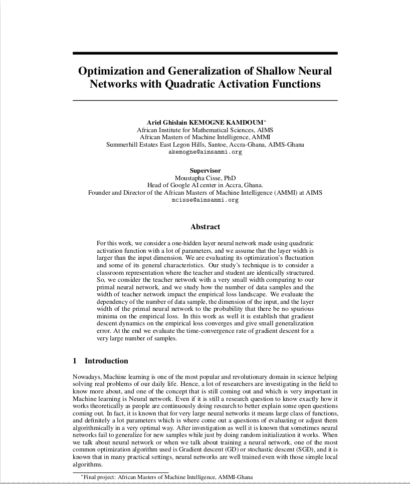
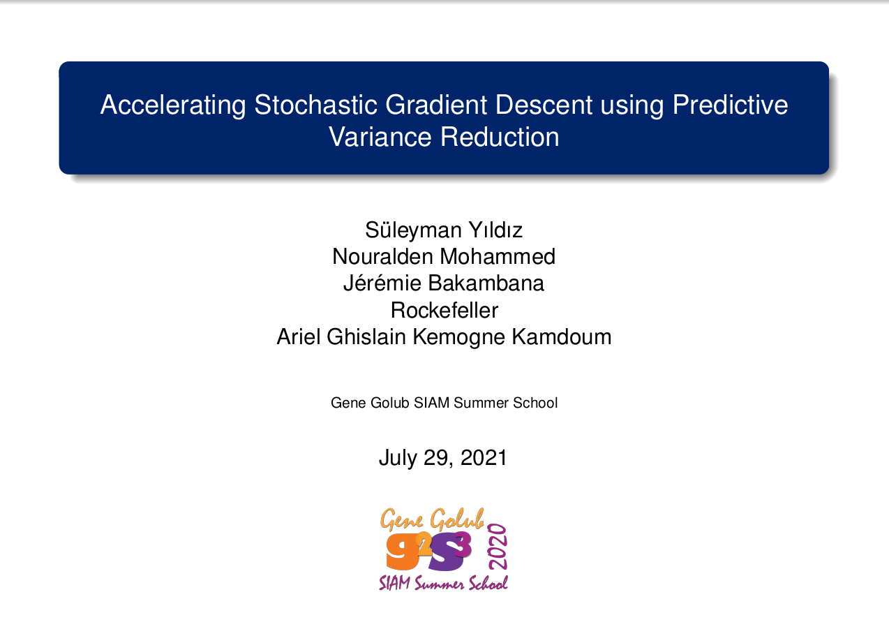
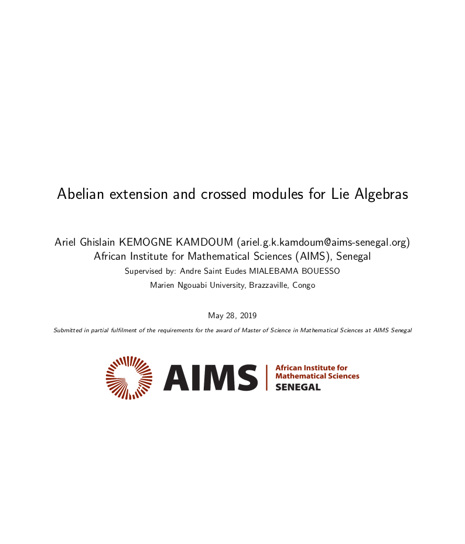
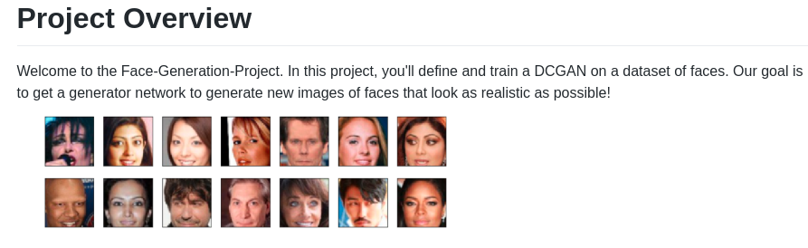
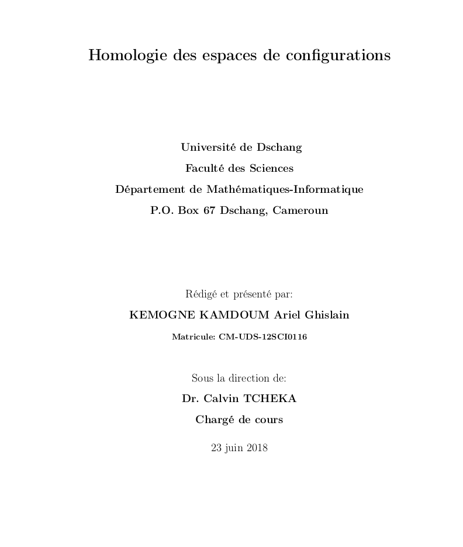






<link rel="stylesheet" href="/glyphicons/css/glyphicons.css" />

<table style="width:100%">
<col width="20%">
<col width="10">
<col >

    
<tr style="border-bottom:1pt solid #eee">
<td markdown="1">

</td>
<td></td>
<td markdown="1">
[**University of Calgary**](https://www.ucalgary.ca/)
    
-PhD Research: Representation Learning for Unstructured Genetic Data with Applications to Polygenic Analysis of Complex Traits 

My research basically focus on developing novel biostatistical and representation learning (AI/ML) methods to identify genetic factors underlying complex diseases such as cancer and cardiovascular disorders, with a strong emphasis on interpretability and mechanistic insight. My research bridges statistical genetics, deep learning, and explainable AI to improve our understanding of disease biology and heritability.
    
<tr style="border-bottom:1pt solid #eee">
<td markdown="1">

</td>
<td></td>
<td markdown="1">
[**University of Calgary**](https://www.ucalgary.ca/)
    
- Research Project: Analysis of multi-scale Data  

This project I worked on making understanding of multi-scale data on a real survival data application.
    
<tr style="border-bottom:1pt solid #eee">
<td markdown="1">

</td>
<td></td>
<td markdown="1">
[**University of Calgary**](https://www.ucalgary.ca/)
    
- Research Project: Survival Analysis of Heart Failure Patients 

In this project I performed survival analysis on heart failure patients data.
    
<tr style="border-bottom:1pt solid #eee">
<td markdown="1">

</td>
<td></td>
<td markdown="1">
[**University of Calgary**](https://www.ucalgary.ca/)
    
- Research Project: Predicting phenotype by genotypes: a comparison of multiple models

The primary objective of this research project is to predict the observable traits or
characteristics of an organism, referred to as the phenotype, based on its genetic
makeup, or genotype. To achieve this, we employ various machine learning tech-
niques, such as ridge regression and lasso, that are commonly used in predictive
modeling.
    
<tr style="border-bottom:1pt solid #eee">
<td markdown="1">

</td>
<td></td>
<td markdown="1">
[**African Institute for Mathematical Sciences (AIMS) in Ghana**](https://aims.edu.gh/)
    
- Research Project: Optimization and Generalization of Shallow Neural Networks with Quadratic Activation Functions    

This project has been done for the completion of my Msc in Machine Intelligence during the [African Master in Machine Intelligence](https://aimsammi.org/), AMMI program in Ghana, sponsored by [Google](https://www.google.com/) and [Facebook](https://en.wikipedia.org/wiki/Facebook).

    
    
    
<tr style="border-bottom:1pt solid #eee">
<td markdown="1">
<!-- {:class="img-shadow"} -->

</td>
<td></td>
<td markdown="1">
[**Gene Golub SIAM Summer School**](https://sites.google.com/aims.ac.za/g2s3-aims-2021/groups?authuser=0)
    
- Research Project: Accelerating Stochastic Gradient Descent using Predictive Variance Reduction

The summer school, founded by SIAM as the result of a generous bequest of former SIAM President Gene Golub, offers schools in applied mathematics, computational science, and industrial mathematics, primarily for graduate students in mathematics and computer science. 
As part of the [South Africa Group](https://sites.google.com/aims.ac.za/g2s3-aims-2021/groups?authuser=0), I worked on [Accelerating Stochastic Gradient Descent using Predictive Variance Reduction](https://proceedings.neurips.cc/paper/2013/file/ac1dd209cbcc5e5d1c6e28598e8cbbe8-Paper.pdf).

<!-- || <em class="icon-home"/> || [project page](https://www.masakhane.io/home) || <em class="icon-github"/> || [Github](https://github.com/masakhane-io/masakhane) || -->
</td> 
</tr>

<tr style="border-bottom:1pt solid #eee">
<td markdown="1">

</td>
<td></td>
<td markdown="1">
[**African Institute for Mathematical Sciences (AIMS)**](https://aims-senegal.org/)
    
- Research Project: Abelian extension and crossed module for Lie algebras
    
This project has been done for the completion of my Msc in Mathematical Sciences at the [African Institute for Mathematical Sciences (AIMS) in Senegal](https://aims-senegal.org/)

<!-- || <em class="icon-home"/> || [Github](https://github.com/Kabongosalomon/Tv-Script-Generation) || -->
</td> 
</tr>

<tr style="border-bottom:1pt solid #eee">
<td markdown="1">
<!-- {:class="img-shadow"} -->

</td>
<td></td>
<td markdown="1">
[**University of Dschang, Cameroon**](https://www.univ-dschang.org/)
    
- Research Project: (Co)homologie des espaces de configuration

This project has been done for the completion of my Master's degree in Mathematics at the [University of Dschang, Cameroon](https://www.univ-dschang.org/)

<!-- || <em class="icon-home"/> || [Github](https://github.com/Kabongosalomon/Face-Generation-Project) || -->
</td> 
</tr>

<!-- 
<tr height="25"/>
<tr style="border-bottom:1pt solid #eee" >
<td markdown="1">
{:class="img-shadow"}
</td>
<td></td>
<td markdown="1">
**AR Camera: An Augmented Reality Prototype for Mobile Devices of Lenovo.**
- Prototyped an application with an AR effect for QR code or a dish of food, to improve user experience.
- Developed detection, tracking and stereo algorithms to obtain a real-time and smooth effect.

|| <em class="icon-film"/> || [video demo](https://youtu.be/XUTCowMHSQs) ||

</td> 
</tr> -->

<!-- </table> -->

