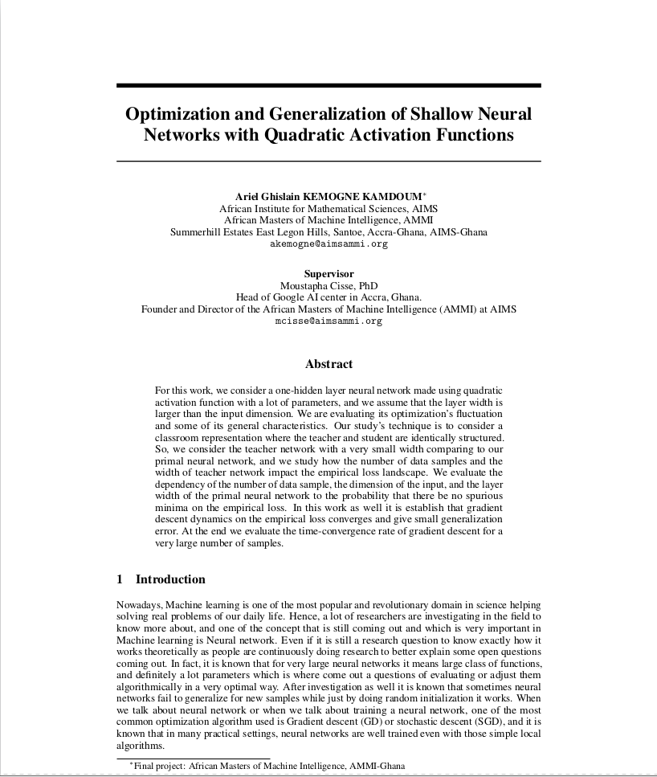
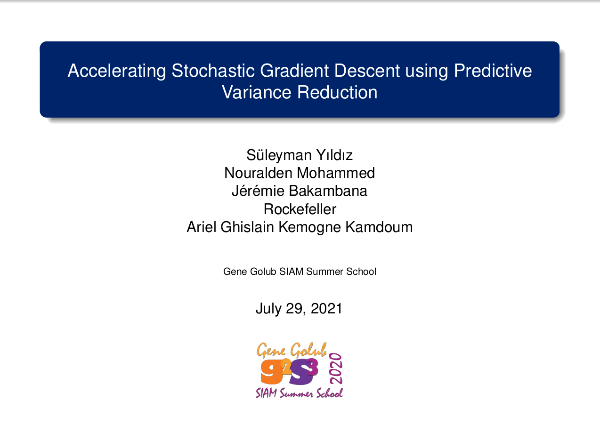
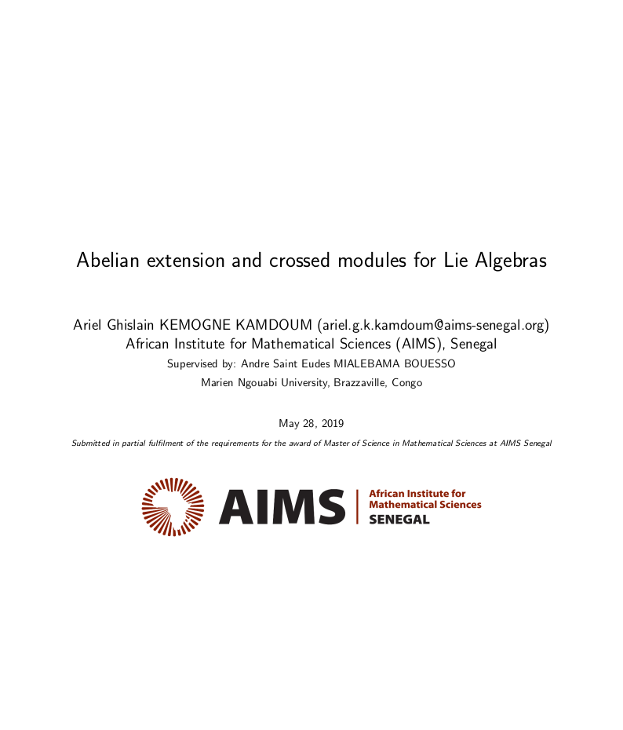
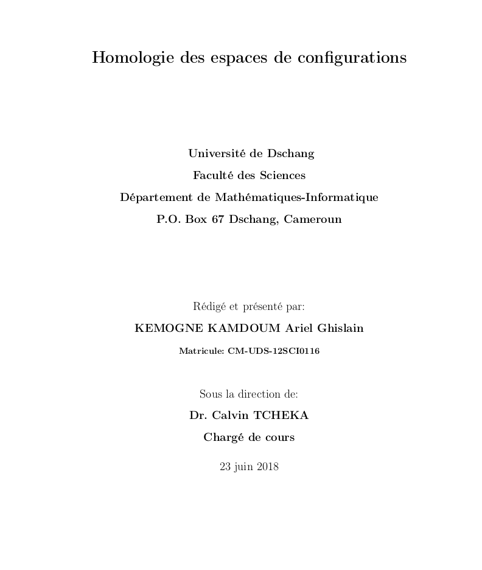






<link rel="stylesheet" href="/glyphicons/css/glyphicons.css" />

  

    This page highlights selected research and applied projects spanning representation learning,
    statistical genetics, survival analysis, machine learning, optimization, and mathematical sciences.
  

---

# Current and Recent Research Projects

  

    

      
    

    

      

        <h3>Representation Learning for Unstructured Genetic Data</h3>
        University of Calgary
      

      

        PhD Research Project
      

      

        This research develops novel biostatistical and representation-learning methods for identifying
        genetic factors underlying complex diseases, including cancer and cardiovascular disorders.
        The project bridges statistical genetics, deep learning, and explainable AI to improve the
        interpretation of disease biology, polygenic architecture, and heritability.
      

      

        Statistical Genetics
        Deep Learning
        Explainable AI
        Polygenic Analysis
        Heritability
      

    

  

  

    

      
    

    

      

        <h3>Analysis of Multi-Scale Data</h3>
        University of Calgary
      

      

        Research Project
      

      

        This project focused on the analysis and interpretation of multi-scale data using a real-world
        survival-data application. The goal was to understand how information measured at different
        biological or clinical scales can be integrated into a coherent statistical analysis framework.
      

      

        Multi-scale Data
        Survival Analysis
        Biostatistics
      

    

  

  

    

      
    

    

      

        <h3>Survival Analysis of Heart Failure Patients</h3>
        University of Calgary
      

      

        Research Project
      

      

        This project applied survival-analysis methods to heart-failure patient data in order to study
        time-to-event outcomes and identify clinical factors associated with patient prognosis.
      

      

        Survival Analysis
        Clinical Data
        Heart Failure
      

    

  

  

    

      
    

    

      

        <h3>Predicting Phenotypes from Genotypes</h3>
        University of Calgary
      

      

        Research Project
      

      

        This project compared multiple statistical and machine-learning models for predicting phenotypic
        traits from genotype data. Methods included regularized regression approaches such as ridge
        regression and lasso, with the broader goal of evaluating how genetic variation can be used for
        predictive modeling of observable traits.
      

      

        Genotype Data
        Phenotype Prediction
        Ridge Regression
        Lasso
        Machine Learning
      

    

  

---

# Graduate and Training Projects

  

    

      
    

    

      

        <h3>Optimization and Generalization of Shallow Neural Networks with Quadratic Activation Functions</h3>
        AIMS Ghana / AMMI
      

      

        M.Sc. in Machine Intelligence Thesis Project
      

      

        This project was completed as part of the African Master’s in Machine Intelligence program in
        Ghana. It investigated optimization and generalization properties of shallow neural networks
        using quadratic activation functions.
      

      

        Completed under the AMMI program, supported by Google and Facebook.
      

      

        Neural Networks
        Optimization
        Generalization
        Machine Intelligence
      

    

  

  

    

      
    

    

      

        <h3>Accelerating Stochastic Gradient Descent using Predictive Variance Reduction</h3>
        Gene Golub SIAM Summer School
      

      

        Summer School Research Project
      

      

        This project was completed as part of the South Africa group at the Gene Golub SIAM Summer
        School on the theory and practice of deep learning. The work explored predictive variance
        reduction methods for accelerating stochastic gradient descent.
      

      

        <a href="https://sites.google.com/aims.ac.za/g2s3-aims-2021/groups?authuser=0">Program page</a>
        &nbsp;|&nbsp;
        <a href="https://proceedings.neurips.cc/paper/2013/file/ac1dd209cbcc5e5d1c6e28598e8cbbe8-Paper.pdf">Related paper</a>
      

      

        Optimization
        Stochastic Gradient Descent
        Variance Reduction
        Deep Learning
      

    

  

  

    

      
    

    

      

        <h3>Abelian Extensions and Crossed Modules for Lie Algebras</h3>
        AIMS Senegal
      

      

        M.Sc. in Mathematical Sciences Thesis Project
      

      

        This project was completed for the M.Sc. in Mathematical Sciences at the African Institute for
        Mathematical Sciences in Senegal. It studied abelian extensions and crossed modules in the
        context of Lie algebras.
      

      

        Lie Algebras
        Homological Algebra
        Mathematical Sciences
      

    

  

  

    

      
    

    

      

        <h3>(Co)homologie des espaces de configuration</h3>
        University of Dschang
      

      

        Master’s Degree in Mathematics Project
      

      

        This project was completed for the Master’s degree in Mathematics at the University of Dschang,
        Cameroon. It focused on the cohomology and homology of configuration spaces.
      

      

        Algebraic Topology
        Cohomology
        Configuration Spaces
        Mathematics
      

    

  

